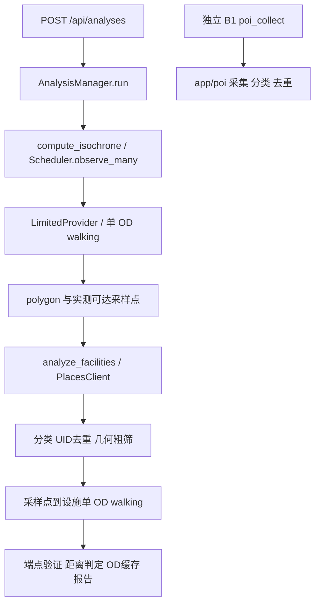

# 第二轮 POI 批量距离矩阵实验报告

本轮结论：**仅模拟网络 PoC；NO，不建议正式合入 Matrix。** 高配额与理想服务端并行假设下，矩阵可以显著缩短取得数值的时间；但数值不满足当前端点证据契约。补做完整单点验证后没有耗时优势。不能把传输收益宣称为生产业务提速。

## 1. 当前 main 与单点链路

日期 2026-09-14，分支 `perf/poi-matrix-poc`，HEAD `69b8a9fecc324b5b5a896be2e8ae98f71b0e3ce7`，拉取核对的 origin/main `659da055e0433decde5785556c4f9c7143ddd76b`。两者在 backend/app 与算法目录一致；HEAD 额外包含上一轮资料提交。

关键位置：`backend/app/analyses.py:88/124/188`、`request_control.py:13`、`facilities.py:22/53/85`；`life-circle-algorithm/src/life_circle/scheduler.py:103`、`providers.py:34/139`、`engine.py:58/168`。`config.py` 中 ANALYSIS_QPS 默认 None，真实任务必须配置。未读取部署值。

现有 Scheduler 默认两个 asyncio 调度任务，有坐标归一化、缓存、预算与重试；共享 gate 持锁到响应结束，完成后再等待至少 1/QPS。真实后端网络并发实际为 1。B1 是另一路网格分页采集，尚未接入正式 facilities；main 的独立 OSM 离线路径也不是本次百度 walking 优化对象。

## 2. 去重、请求数量与可批量边界

正式设施采集按五关键词、最多两页，UID 合并，冲突记录剔除；B1 有参数缓存、UID 聚合与复核。Scheduler 对六位小数坐标去重，cache 隔离 provider/起点/坐标系；设施 cache 使用采样点坐标与设施 UID。不同 UID 同坐标可能绑定不同入口，不能简单折叠。

每个 POI **不是固定一次 walking**：可能因粗筛/候选上限/早停而为零，也可能从最多 9 个采样点分别请求；每个不同 OD 正常一次，临时错误最多两次 attempt。设施每大类最多 8 候选、半径 1200m 粗筛，确认覆盖即停止；中心路线可供后续 routes 查询复用。

同一 origin、相同 BD09LL/provider/UID 语义、已经确定必须请求的独立目的地，在纯传输层适合组批；已缓存 OD 不必重发。不能直接组批跨自适应采样轮次的未知点，也不能预取全部设施候选后声称保持原早停请求量。当前单点选择最短距离路线并校验 steps 实际端点偏移不超过 50m；这些不能从矩阵距离/时间两个数字推出。

## 3. 官方批量能力核对

官方支持 GET `https://api.map.baidu.com/routematrix/v2/walking`，包括 1 origin→N destinations 与多起终点。步行每次起终点数量乘积最多 50，大陆范围，任一 OD 不超过 200km。配额及每秒并发按最终 OD 路线数计算，不按 HTTP 数计算。[官方概览](https://lbsyun.baidu.com/docs/webapi?title=routematrix/routchtout)

origins/destinations 为纬度,经度，点之间用 `|`，支持 `;UID`；coord_type 默认 bd09ll，也支持 bd09mc/gcj02/wgs84。PoC 显式 bd09ll、output=json、ret_straight_dist=0。返回按起点优先展开；米/秒数值无结果可为 0。整体 status 0/1/2 分别成功/内部错/参数错，文档没有逐格独立错误码，也没有 steps/path/实际端点；PoC 不臆造这些字段。[官方参数与响应](https://lbsyun.baidu.com/docs/webapi?title=routematrix/routchtout-walk)

官方默认权益示例：批量算路个人/企业试用/企业授权的每秒路线数 3/30/200，日额度 5000/100000/300000。实际权限以账户为准。50 是本地假设的 OD/秒预算，不是读取的真实权限，也不是所有账户通用额度。[官方配额表](https://lbsyun.baidu.com/cashier/quota?from=privilege)

官方响应不足以证明当前业务语义，因此停止强行接入生产。后续实验仅测量隔离的数值传输与完整回退成本；没有把 endpoint_verified 伪设为 true。

## 4. PoC 设计

代码只位于被忽略的 `.tmp/poi-matrix/`。HTTP client 强制 MockTransport，不能用于真实 API。一个 origin，目的地携带原 UID，按顺序分批，数量检查后按文档顺序恢复输入 ID。最大批次来源于本轮核对的官方 50 OD 限制。

实际批次上限为 `min(请求批次, 50, floor(模拟OD每秒额度))`。3 OD/秒下，要求的 5/10/20/50 都会收敛为 3，合并为同一有效配置测量；50 OD/秒档分别实际测 5/10/20/50，每组至少三次。N 小于批次上限时实际批次就是 N。

限流延续响应完成后间隔，但 interval 按本批 OD 权重/QPS 计算，并增加加权滚动秒窗口校验。所有 HTTP（包括重试）都计入 OD 配额，最多一个 HTTP 在途；403/429/明确参数错误停止后续批次，timeout/临时失败最多重试一次，保留共享冷却和取消/截止检查。HTTP 成功中的单个零值/格式错误只影响该目的地；数组长度异常无法可靠对齐则整批 unknown。

PoC 两类输出：矩阵原始 distance/duration 仅放在 raw 字段，业务字段保持 unknown；matrix_then_single 变体再对全部 N 个 OD 调用现有单点 Provider，以取得真正端点与路径证据。这一回退策略只用于验证成本，没有接入生产。

## 5. 环境、输入与公平性

Python 3.11.7 (tags/v3.11.7:fa7a6f2, Dec  4 2023, 19:24:49) [MSC v.1937 64 bit (AMD64)]；OS Windows-10-10.0.26200-SP0；依赖 httpx 0.28.1, shapely 2.1.2, pydantic 2.13.5, pytest 9.1.1。解释器为 `D:/CodexCaches/baidu-map-algorithm-venv/Scripts/python.exe`。

沿用第一轮固定中心 `(121.513926,31.313077)`、400m 圆周、N=10/25/50/100、唯一 UID 和坐标、五类均匀分配；没有减少 POI，没有热缓存。阈值保持 walking 1000m/100m 容差与 900s。比较共 24 轮新基线、78 轮矩阵/回退/敏感性运行，每配置三轮。基线先保存，主矩阵计时在全部基线完成后开始。生产源码与原单点 harness SHA256 复核一致。

单点使用现有 BaiduProvider parser + RateGate/request_slot。输入规模指固定全部 N 个 OD 的测试核；不含搜索、等时圈和完整设施早停流程。基线请求数为 N；矩阵仍计算 N 个 raw 数值；完整回退则额外 N 个 OD，明确计数而不隐藏。

**仅模拟网络 PoC**：单 OD 延迟设定 30/40/50ms。主要矩阵模型等待批内最大单 OD 延迟，假设服务端充分并行；这是乐观假设，不是百度实测。额外串行服务模型等待批内各 OD 延迟之和，检查结论敏感性。两版本使用相同 fixture；模拟距离相同是输入设计，不是对真实 API 等价性的发现。

使用真实 perf_counter wall-clock，Windows 定时器有粒度波动；没有用虚拟时钟推算性能。部分小型测试与等待阶段重叠，三轮是描述性统计，不证明毫秒差异显著。所有 API 性能请求均在内存 MockTransport 内完成，真实 Provider 调用数为 0。

## 6. 可比低配额结果：3 OD/秒

| N | batch上限 | 单点均值秒 | 矩阵均值秒 | 下降% | Speedup | HTTP 单→矩阵 | OD 单→矩阵 | 完整证据一致率 |
| --- | --- | --- | --- | --- | --- | --- | --- | --- |
| 10 | 3 | 3.549371 | 3.243261 | +8.624% | 1.0944× | 10→4 | 10→10 | 0% |
| 25 | 3 | 9.375030 | 8.593696 | +8.334% | 1.0909× | 25→9 | 25→25 | 0% |
| 50 | 3 | 19.058971 | 17.180135 | +9.858% | 1.1094× | 50→17 | 50→50 | 0% |
| 100 | 3 | 38.492838 | 35.397012 | +8.043% | 1.0875× | 100→34 | 100→100 | 0% |

最大下降 9.858%（N=50），属于弱收益范围；N=50/100 未达到明显或显著收益。全部矩阵仍缺当前端点证据，0% 完整证据一致率不是 HTTP 失败率。

## 7. 批次敏感性：50 OD/秒

本节单点基线也配置 50 OD/秒，禁止拿上一节 QPS=3 的基线计算本节 speedup。

| N | batch 5 秒 | batch 10 秒 | batch 20 秒 | batch 50 秒 | 最短均值对应批次上限 |
| --- | --- | --- | --- | --- | --- |
| 10 | 0.234431 | 0.058642 | 0.063370 | 0.063922 | 10 |
| 25 | 0.741922 | 0.589769 | 0.522526 | 0.056037 | 50 |
| 50 | 1.593329 | 1.116129 | 1.001006 | 0.062946 | 50 |
| 100 | 3.307682 | 2.443187 | 2.084780 | 1.130808 | 50 |

每规模最短均值的配置：

| N | batch上限 | 单点均值秒 | 矩阵均值秒 | 下降% | Speedup | HTTP 单→矩阵 | OD 单→矩阵 | 完整证据一致率 |
| --- | --- | --- | --- | --- | --- | --- | --- | --- |
| 10 | 10 | 0.728275 | 0.058642 | +91.948% | 12.4190× | 10→1 | 10→10 | 0% |
| 25 | 50 | 1.900632 | 0.056037 | +97.052% | 33.9176× | 25→1 | 25→25 | 0% |
| 50 | 50 | 3.853674 | 0.062946 | +98.367% | 61.2219× | 50→1 | 50→50 | 0% |
| 100 | 50 | 7.744753 | 1.130808 | +85.399% | 6.8489× | 100→2 | 100→100 | 0% |

最大数值传输下降 **98.367%**、speedup **61.2219×**（N=50，批次上限 50）。这不是正式业务速度，因为数值缺证据且延迟模型假设理想并行。N=10 时批次上限 10/20/50 实际同为一批 10，细小均值差异不能解释为调参收益；N=50/100 的容量最优为 50，仍不是生产最优结论。

wall-clock 在结果返回时停止；首批可以消费一秒内可用 OD 配额，因此一次请求覆盖全部 N 时存在冷启动突发优势。原始数据另存 `quota_release_wall_seconds`，表示本轮结束后 gate 的后续冷却释放时刻；CSV 给出单点释放时间近似值 mean+1/QPS。不得把短窗口 HTTP/耗时的平均 OD 吞吐当作超过配额；实际检查的是滚动一秒 OD 总量。

## 8. 完整语义回退成本与延迟敏感性

矩阵之后补发全部单点验证，50 OD/秒、同样三轮：

| N | batch上限 | 单点均值秒 | 矩阵均值秒 | 下降% | Speedup | HTTP 单→矩阵 | OD 单→矩阵 | 完整证据一致率 |
| --- | --- | --- | --- | --- | --- | --- | --- | --- |
| 10 | 50 | 0.728275 | 0.998928 | -37.164% | 0.7291× | 10→11 | 10→20 | 100% |
| 25 | 50 | 1.900632 | 2.478308 | -30.394% | 0.7669× | 25→26 | 25→50 | 100% |
| 50 | 50 | 3.853674 | 4.919835 | -27.666% | 0.7833× | 50→51 | 50→100 | 100% |
| 100 | 50 | 7.744753 | 9.915277 | -28.026% | 0.7811× | 100→102 | 100→200 | 100% |

完整证据及路径结果与单点 100% 一致，但 OD 从 N 变为 2N，HTTP 从 N 变为 N+ceil(N/batch)，全部配置都没有提速。若只验证部分候选，需要另行证明不会错判其它 POI；本轮不删减验证步骤来获取好看的时间。

假设矩阵内部串行计算的敏感性（50 OD/秒、批次 50、三轮）：

| N | batch上限 | 单点均值秒 | 矩阵均值秒 | 下降% | Speedup | HTTP 单→矩阵 | OD 单→矩阵 | 完整证据一致率 |
| --- | --- | --- | --- | --- | --- | --- | --- | --- |
| 50 | 50 | 3.853674 | 1.995183 | +48.226% | 1.9315× | 50→1 | 50→50 | 0% |
| 100 | 50 | 7.744753 | 5.015156 | +35.244% | 1.5443× | 100→2 | 100→100 | 0% |

这两种延迟模型给出的收益差异说明真实服务延迟必须实测；都不解决端点证据缺口。

## 9. HTTP、配额、延迟与错误

低配额矩阵 HTTP 数：10→4、25→9、50→17、100→34；OD 均仍为 N。高配额大批次可变为 10→1、25→1、50→1、100→2，最多减少 HTTP **98%**，不减少正常路线配额。主干净样本的 retry/failure 均为 0。

| QPS | N | 单点等待秒 | 矩阵等待秒 | 单点 p50/p95 ms | 矩阵 p50/p95 ms |
| --- | --- | --- | --- | --- | --- |
| 3 | 10 | 3.073036 | 3.027166 | 46.10/62.25 | 60.17/61.71 |
| 3 | 25 | 8.197038 | 8.065647 | 46.13/62.43 | 61.51/62.29 |
| 3 | 50 | 16.714003 | 16.140436 | 46.28/62.51 | 61.64/62.62 |
| 3 | 100 | 33.759929 | 33.309259 | 46.44/62.75 | 61.68/63.04 |
| 50 | 10 | 0.274833 | 0.000034 | 46.51/61.80 | 57.89/57.89 |
| 50 | 25 | 0.733597 | 0.000036 | 46.45/62.57 | 55.02/55.02 |
| 50 | 50 | 1.496032 | 0.000039 | 46.34/62.67 | 61.72/61.72 |
| 50 | 100 | 3.019355 | 1.010118 | 46.04/62.29 | 59.01/61.07 |

p50/p95 是每轮 mock HTTP callback 延迟的分位数、再对三轮取均值，不包含 gate 排队或真实 DNS/TLS；请求均值、min/max、所有事件与额外指标见 JSON/CSV。

故障诊断：N=25 中两个目的地无结果，两个指定 OD 首次临时失败。矩阵若整批 HTTP 503，健康格也被带入重试：

| N | batch | 单点 HTTP/重试OD | 矩阵 HTTP/重试HTTP/重试OD | 数值无结果数 |
| --- | --- | --- | --- | --- |
| 25 | 5 | 27/2 | 7/2/10 | 2 |
| 25 | 20 | 27/2 | 3/1/20 | 2 |

批次 5 时原来 2 个重试 OD 变为 10；批次 20 时变为 20。因此“重试 HTTP 更少”不代表更省配额，错误影响范围及重试语义与单点不完全相同。零值不会污染其余 raw 数值；但文档不能区分单格零值背后的详细失败原因。

## 10. 正确性与数值误差

78 组与对应新基线配对，POI 集合、坐标、分类、固定几何下 count_in_circle 全部一致。干净 fixture 上原始距离和时间的最大/平均误差均为 **0**；这是同源模拟值的验证，不是实际两种服务误差为零。完整 count_in_circle 比较用现有 Facility 分类与相同 polygon 几何计算；没有声称测试了完整分析报告。

纯矩阵保守处理：有效 raw 数值成功数 N，raw unknown=0；但 endpoint_verified 全为 false，业务字段全部 unknown。单点已验证的 reachable/unreachable 在矩阵不能确证；干净输入的 reachable 状态和完整证据一致率均为 **0%**。距离阈值一致率有部分相同，仅因为基线部分数值原本也处于容差 unknown。矩阵不能直接驱动现有设施正向覆盖判断。

补充构造反例展示最短距离选路与单值响应可能不一致：单点可选 950m/700s，而矩阵单值 1050m/600s；差异 100m/100s。这是逻辑反例，不是观测到的百度偏差。实际平均/最大跨 API 误差目前 **未测得**。

矩阵后完整单点回退的 12 组输出 SHA256 均与单点完全一致，包含路径、端点、阈值结果与错误字段。现有相关 pytest **226 passed（10.48s）**；本地 Matrix 测试 **24 passed（5.44s）**，覆盖上限、顺序、零值隔离、异常响应、429停止、重试计费、timeout冷却、加权滚动秒、取消/截止、端点反例及完整回退。

## 11. 真实 Provider 测试

未执行真实百度测试。只检查了本地 `127.0.0.1:8000/health`，当时不可访问；未据此推断凭据不存在。未读取 .env 或真实 AK，未启动会加载凭据的服务，未核验真实矩阵权限与 OD 配额。且当前业务证据不兼容，不能为了出真实成绩强行替换。真实误差、服务端批处理延迟和配额到达行为均待验证。

## 12. 风险与决策

本轮不能确认“当前业务显著降低耗时”：3 OD/秒收益弱；50 OD/秒理想模型的数值传输虽显著，完整语义不一致；补验证后无收益。三个必要条件（正确性、真实配额安全、N=50/100明显提速）尚未同时满足。因此 **NO，不建议正式合入 Matrix**。

风险包括：矩阵没有现有端点/path证据；零值原因不明确；多路线 metric 选择未证等价；批次失败放大 OD 重试；预取改变早停、取消与预算；不同进程/独立 POI 命令尚无账户级联合限流；模拟滚动窗口不等于真实平台所有执行细节已验证。

## 13. 推荐正式实现方式与下一瓶颈

当前不落地生产 Matrix adapter，保留单点 Provider 与现有缓存/粗筛。下一优先级是**端点/选路契约兼容性**，其次是 OD 配额和真实服务耗时。先在明确账户权限与小额调用预算后做成对真实测试，验证 raw 数值、UID绑路、缺结果与端点证据能否等价；无法等价就不作为正向覆盖证据。

若未来获得充分证据，再单独设计 provider capability、按 OD 加权的共享 limiter、动态 batch（官方上限/账户额度/待发预算三者最小）、截止/取消、逐格 unknown、整批失败重试账本与单点 fallback。缓存必须包含 provider版本/metric/坐标系/OD/UID，不预取本来会早停的候选。真实收益达标后另提正式代码审查，不把本地 PoC 直接搬入生产。

## 14. 复现与数据定位

原始 24 轮基线在 matrix-baseline.json，78 轮矩阵/回退/敏感性在 matrix-results.json，26 个三轮汇总配置在 matrix-comparison.csv，配对检查/故障诊断/测试/源码哈希在 matrix-validation.json。source 与输入哈希可用于追溯。两档预算、两种延迟模型以及 raw/完整语义必须分别解读。

本地代码 `.tmp/poi-matrix/run_baseline.py`、`run_matrix.py`、`diagnostics.py`、`test_matrix.py` 可在上述 Python 环境运行；基线与主结果存在时拒绝覆盖。复跑需先复制实验脚本到新的本地实验位置并把输出改到新目录，保留原始 fixture/QPS/latency 参数，不能覆盖已保存结果。依赖上一轮仍在本地的 `.tmp/poi-distance/benchmark.py` 与安全测试启动器。源码按要求不提交，因此仅下载报告/JSON 无法直接运行完整 harness。

## 15. Git 复核与提交范围

最终 GitHub 接口核对：实际 main 为 `26a4e0755ab4ee8f6b1242e795189dea2b484415`；命令行最终 fetch 因网络连接失败，本地 origin/main 引用仍为 `659da055e0433decde5785556c4f9c7143ddd76b`，不能把本地旧引用称为最新。GitHub compare 核对新 main 相对本轮基线的变化包含上一轮报告、其它报告脚本与前端更新，但 **backend/app 与 life-circle-algorithm 没有变化**，故不影响本轮算法对照。未为同步前端变化而修改工作区。

上一轮 [PR #26](https://github.com/25303050164/Baidu-map/pull/26) 在实验期间已合并，最终状态 `closed`、merged=`True`，head `69b8a9fecc324b5b5a896be2e8ae98f71b0e3ce7`。本轮没有等待它合并。后续准备独立资料 PR 时刷新本地远端引用、核对最终 diff 只新增本轮六个资料；本轮不自动改分支、commit 或 push。

本轮只新增以下六个可提交文件：

- `backend/docs/performance/poi-distance/matrix-baseline.json`
- `backend/docs/performance/poi-distance/matrix-results.json`
- `backend/docs/performance/poi-distance/matrix-comparison.csv`
- `backend/docs/performance/poi-distance/matrix-validation.json`
- `backend/docs/performance/poi-distance/POI批量距离矩阵实验报告.md`
- `backend/docs/performance/poi-distance/POI批量距离矩阵接入建议.md`

禁止提交：`.tmp/poi-matrix/` 所有实验实现、harness、测试与本地辅助文件，以及复用的 `.tmp/poi-distance/` 源码。生产后端、算法、前端与凭据文件未修改。最终 status/diff/check 结果写入 matrix-validation.json；新资料尚未暂存时 git diff --stat 为空是正常现象。
