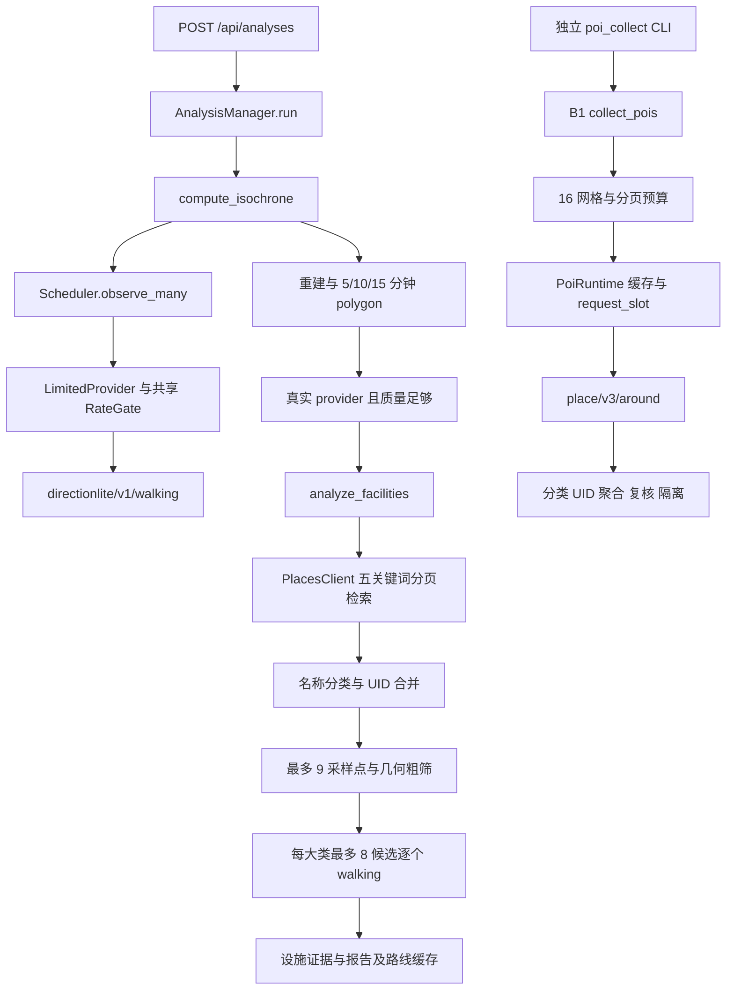

# POI 距离计算性能专项审计

审计日期：2026-09-14。分支：`perf/poi-distance-optimization`。本地 HEAD、main、origin/main 均为 `659da055e0433decde5785556c4f9c7143ddd76b`。未 fetch，结论针对上述已存在的本地 main 快照。

结论：当前代码已有去重、缓存、异步调度和严格 QPS 控制，但正式后端的网络 slot 持有至响应完成，实际网络并发为 1。新增四个 worker 没有显著降低运行时间。几何复用减少 CPU 工作量，但完整设施流程几乎没有提速。**本轮不能宣称已经达到“大量 POI 显著降耗时”的评价点。建议提交实验记录，暂不正式合入优化代码。**

## 1. 当前算法调用链

B1 采集器没有接入上方 `analyze_facilities` 调用，不能把新增目录当成已批量计算 POI 路线。原始等时圈 walking 是中心→自适应网格采样点；设施阶段才是实测采样点（含中心）→POI。

main 另有 `backend/app/osm_api.py` 与 `backend/app/algorithms/osm_offline/` 的独立离线路网入口。它不调用百度 walking，不能通过切换数据源把本轮百度 POI 距离优化伪装成等价提速；未纳入本次对照，也未修改。

| 文件位置（相对仓库根） | 作用 |
| --- | --- |
| `backend/app/analyses.py:88,124,188,284` | 全局 gate、provider 包装、分析编排、单设施路线复用 |
| `backend/app/request_control.py:13` | 持锁等待配额、发送、完成后冷却 |
| `backend/app/facilities.py:22,53,85` | 设施检索、OD cache、采样点设施评估 |
| `backend/app/places.py:35,101,117` | 五类名称规则、UID 去重、最多两页 |
| `backend/app/place_protocol.py` | 状态码、分页完整性与停止条件 |
| `backend/app/poi/service.py:12`、`runtime.py:127`、`planner.py:15` | 独立 B1 采集、请求缓存/预算、网格分页 |
| `backend/app/config.py:17` | ANALYSIS_QPS 无默认实值，真实分析缺配置返回 503 |
| `life-circle-algorithm/src/life_circle/engine.py:58,168` | 调度查询与线程中几何计算 |
| `life-circle-algorithm/src/life_circle/scheduler.py:18,103` | 批次任务、去重缓存、重试与预算 |
| `life-circle-algorithm/src/life_circle/providers.py:34,139` | 单 OD 步行 API 与实际端点校验 |

## 2. POI、去重与请求复用

正式设施流程按五个关键词搜索，每个最多两页，按名称规则分类为市场、超市、药店、医院药房、学校，归入购物/医疗/教育三大类。同 UID 合并，不一致 UID 记录剔除并保留 partial/unknown。结果排序稳定。B1 默认三类共六个关键词，4×4 网格形成 96 条检索序列，先每序列第一页、再轮询后续页，每页 20 条、最多 8 页，并受类别/总预算约束；无效记录隔离，疑似重复和有歧义分类进入复核。

Scheduler 使用六位小数规范坐标去重，缓存空间含 provider 身份、起点与坐标系，批次间命中复用。设施 OD cache 键为 `(sample.destination, facility.id)`，同一评估中不重复请求；中心路线保存在结果中，后续 routes 查询优先复用，额外查询有锁和三次上限。B1 请求缓存包含完整参数与版本，同键受锁保护。重试仍计真实 attempt，失败不当作成功缓存。

不同 UID 即使坐标相同也不能直接折叠：walking 携带 destination_uid，入口绑定可能不同；B1 只标注疑似重复。不同任务没有通用跨任务 OD cache，跨等时圈/设施 provider 的 metric 与 UID 也不相同，不能仅凭经纬度相同复用。当前已有 1200m 几何粗筛、找到覆盖即停止；不得为跑分改采样量、1000m 规则或容差。

## 3. 当前是否使用批量矩阵

没有。源码使用单 OD `/directionlite/v1/walking`；`observe_many` 是调度批次，不是百度矩阵 HTTP 请求。百度确有步行 RouteMatrix，方案 A 的正式约束见第 12 节，本轮没有虚构矩阵 Provider 或矩阵收益。

## 4. 当前并发与 QPS

Scheduler 默认 concurrency=2，以 asyncio 任务分组调度；设施与 B1 搜索循环本身串行。后端所有相关请求经过 `attempt_lock`，直到收到响应才释放，并从完成时刻再等至少 `1/ANALYSIS_QPS`。timeout/rate_limit/interrupted 触发共享冷却，wait 会复核定时器提前唤醒。请求具有取消、截止时间、重试及停止语义。HTTP 没有 ThreadPool；`asyncio.to_thread` 用于 polygon/field CPU 工作。

`ANALYSIS_QPS` 源码默认 None，真实任务创建要求显式配置；本轮没有读取部署值。B1 有自己的 runtime/gate，多个进程或独立采集命令之间未形成账户级统一限流。单进程测试合规不能证明多进程共用账户合规。

## 5. Baseline 方法

**模拟网络 benchmark**：N=10/25/50/100，每个规模三轮，基线先完成并保存，再生成本地几何优化版本并运行对照。冻结六个生产源码文件、提交号、输入/输出及 harness SHA256；复核均未改变。

主测量固定一个中心→N 个不同 POI，完整执行 N 次现有 BaiduProvider 解析，避免 facilities 的每类候选上限导致 N=50/100 实际工作量相同。它衡量 OD 距离层，不包含等时圈自适应采样、POI 搜索及 polygon 的全应用时间；不是模拟为每个真实用户必定计算全部 POI。

fixture：固定中心 `(121.513926,31.313077)`，半径 400m 等角度圆周，坐标六位小数、唯一 UID，五类均分，无热缓存。模拟距离循环为 800/999/1000/1101m，覆盖确证、容差 unknown、阈值边界与阈值外情况。每个请求采用 httpx.MockTransport，指定等待 30/40/50ms；保留真实 parser、QPS gate、retry 判定。真实物理网络请求数为 **0**。所有 fixture 都是测试输入，不能作为社区统计或真实路线结果。

模拟 QPS 明确固定为 3，两版本共享相同 gate 行为；既未加载生产设置，也未提高实际账户配额。计时为 perf_counter 实际 wall-clock；Windows 定时器使实测响应均值约 46.7ms，高于设置的约 40ms。请求均值/p50/p95 是 mock callback 时长，不包括排队、DNS/TLS；每轮指标见原始 JSON。

主基线为串行 OD 循环；B 为最多四个任务的 worker pool，其他输入、gate、解析和重试相同。主套件保留全部 N 个结果。额外完整设施测试保持默认 9 个采样点、每大类 8 个候选、早停和报告生成，用于验证几何实验 C，详见第 9/11 节。

## 6. 测试环境

- Python：3.11.7 (tags/v3.11.7:fa7a6f2, Dec  4 2023, 19:24:49) [MSC v.1937 64 bit (AMD64)]。
- OS：Windows-10-10.0.26200-SP0；CPU：AMD64 Family 25 Model 97 Stepping 2, AuthenticAMD。
- 依赖：httpx 0.28.1, shapely 2.1.2, pydantic 2.13.5, pytest 9.1.1, numpy 2.4.6, contourpy 1.3.3。
- Python 环境：`D:/CodexCaches/baidu-map-algorithm-venv/Scripts/python.exe`。
- 同一桌面进程环境，三轮描述性统计，未绑核；少量正确性控制测试与主套件等待阶段重叠。未建立统计显著性或真实云环境置信区间，毫秒级差别视为噪声。
- 未读取或修改凭据文件、未读取/打印真实 AK、未调用真实 Baidu。真实账户权限、QPS 和联合测试预算未核验，故没有追加付费/配额消耗的在线测试。不能把离线结果称为真实网络实测。

## 7. 数据规模与计数口径

主 baseline 和 B 各 12 轮、各 555 次 mock HTTP，全部 unique OD 冷启动；每轮路线调用=N，重试=0，成功=N、失败=0，实际并发=1。`route_requests`/`mock_http_attempts` 包含重试 attempt；`real_network_requests` 独立为 0，不能将 mock HTTP 写成真实外网请求。诊断故障套件另外记录失败和重试，不混入干净样本均值。

`correctness.json` 还保存零网络延迟且关闭 pacing 的完整设施 CPU 控制、混合错误诊断（mock QPS=100，仅缩短正确性测试）、N=10/QPS=3 完整设施对照。不同 suite 不能混合平均。

## 8. 本地实验方案

B：四 worker 有界并发；保留共享响应完成后限流，不取消锁或增大 QPS。错误作为每 POI 的 RouteObservation 隔离，临时错误最多两次；意外异常传播并取消/等待其他 worker，外部取消不会留下任务。

B 只应用于固定 OD 实验核，没有替换生产设施循环。直接并行预取全部候选会改变现有“找到覆盖即停止”的请求数量以及全局停止顺序，因此本轮不把该 worker 当成可直接接入的完整设施优化。完整设施输出与停止行为的对照对象是 C。

C：一次性投影每个 POI、按大类复用列表；每采样点仅投影一次并缓存到各 POI 的几何距离，排序与粗筛复用该值。相同排序 tie-break、过滤半径、采样、请求顺序、重试、早停、unknown 与报告保持不变。这是纯计算复用，没有用更少的 POI 或 walking 请求冒充加速。

A：仅完成官方可行性审查。当前缺少与 endpoint_verified 等价的矩阵证据，不实现假定等价的替代路径。

## 9. 运行时间与 Speedup

| POI N | Baseline mean [min,max] 秒 | B mean [min,max] 秒 | 减少秒数 | Speedup | 时间下降 | 路线/HTTP 每轮 | 错误/重试 |
| --- | --- | --- | --- | --- | --- | --- | --- |
| 10 | 3.545984 [3.538140, 3.557878] | 3.547563 [3.539190, 3.552228] | -0.001579 | 0.999555 | -0.0445% | 10 → 10 | 0/0 → 0/0 |
| 25 | 9.375231 [9.370020, 9.380142] | 9.384746 [9.373876, 9.397758] | -0.009515 | 0.998986 | -0.1015% | 25 → 25 | 0/0 → 0/0 |
| 50 | 19.108403 [19.094380, 19.123473] | 19.092734 [19.080942, 19.114246] | +0.015669 | 1.000821 | +0.0820% | 50 → 50 | 0/0 → 0/0 |
| 100 | 38.535013 [38.521111, 38.547031] | 38.550432 [38.537420, 38.573972] | -0.015419 | 0.999600 | -0.0400% | 100 → 100 | 0/0 → 0/0 |

Speedup=Baseline mean / Optimized mean；时间下降=(Baseline mean−Optimized mean)/Baseline mean×100%。负数表示变慢。

主指标最大 speedup 是 **1.000821×（N=50，下降 0.0820%）**，不能认定有效提速。N=10 收益不存在；N=50/100 同样没有随规模增大的收益。

| N | 版本 | 平均响应 ms | p50 ms | p95 ms | 平均 QPS | 滚动 1 秒最多发送 | gate 等待/总耗时 |
| --- | --- | --- | --- | --- | --- | --- | --- |
| 10 | Baseline | 46.664 | 46.282 | 62.814 | 2.820 | 3 | 86.64% |
| 10 | B/4 workers | 46.828 | 45.992 | 61.887 | 2.819 | 3 | 86.59% |
| 25 | Baseline | 46.808 | 46.178 | 62.517 | 2.667 | 3 | 87.32% |
| 25 | B/4 workers | 46.909 | 46.148 | 62.781 | 2.664 | 3 | 87.32% |
| 50 | Baseline | 46.694 | 46.311 | 62.769 | 2.617 | 3 | 87.59% |
| 50 | B/4 workers | 46.570 | 46.465 | 62.702 | 2.619 | 3 | 87.64% |
| 100 | Baseline | 46.670 | 46.354 | 62.735 | 2.595 | 3 | 87.70% |
| 100 | B/4 workers | 46.631 | 46.400 | 62.398 | 2.594 | 3 | 87.74% |

表中分位数是三轮各自分位数的均值，未冒充所有请求混池的分位数；滚动秒窗口按 mock callback 开始时间统计。每轮都未超过 mock QPS 3。

CPU 控制（完整 facilities，零延迟、关闭 pacing，三轮均值；不是生产耗时）：

| N | Baseline mean ms | C mean ms | Speedup | 时间下降 | 投影调用数 | 路线数不变 |
| --- | --- | --- | --- | --- | --- | --- |
| 10 | 22.925 | 21.587 | 1.0620 | 5.84% | 360 → 19 | 90 |
| 25 | 44.714 | 44.432 | 1.0063 | 0.63% | 900 → 34 | 189 |
| 50 | 55.401 | 50.473 | 1.0976 | 8.89% | 1800 → 59 | 216 |
| 100 | 54.340 | 53.261 | 1.0203 | 1.99% | 3600 → 109 | 216 |

CPU 控制最大 1.0976×，含桌面计时波动，不能用它替代主指标。N=50 与 100 的实际路线数均为 216，是现有业务上限造成的饱和，并非删减输入；完整输出仍含 N 个 POI。min/max 另保存在 validation.json。

带延迟、mock QPS=3 的完整设施 N=10 三轮确认：Baseline **15.429296s**，C **15.426399s**，speedup **1.000188×**，下降 **0.0188%**；每轮 5 次 POI +36 次 walking，投影 360→19 次，结果完全一致。它与主表 N=10 的十个 OD 工作负载不同，不能直接比较绝对时间。

## 10. 瓶颈解释

在主模拟网络套件中，gate 等待占总耗时约 86.6%–87.7%，响应等待约 12%–13%，剩余是调度/解析等开销；已是 QPS gate 主导，并没有因新增 worker 才从网络转移。四 worker 都等待同一整请求锁，不能覆盖响应时间。

干净请求的近似下限为 `T >= (N−1)/QPS + sum(response_latency)`，再加定时器及解析开销。当前响应完成后间隔语义下，大 N 的吞吐约 `1/(1/QPS + latency)`。QPS=3、平均响应约 0.0467s 时约 2.63 次/秒，与实测大 N 约 2.60 相符。更多 worker 不改变这个约束。

按代码判断，正式百度链路主要候选瓶颈是等时圈与设施 walking 请求量、QPS 等待、POI 搜索分页，以及出错时重试/冷却。geometry 在本地 CPU 控制中只是毫秒级；本轮没有完整真实分析的分阶段实测，**不能给 POI 搜索、等时圈 polygon 与 walking 作生产占比排名**。干净主套件没有 retry，故 retry 不是本套件瓶颈；故障场景下会增加 attempt 和共享冷却。

## 11. 正确性和回归测试

12 组主基线/B 配对全部输入和输出 SHA256 一致。19 组完整 facilities/C 配对覆盖四规模×三轮、N=100 的成功/503重试/无结果/403停止/同 UID 重复记录、三轮网络节拍确认；比较全部设施、类别、coverage assessments、summary、routes、report，仅排除自然变化的 elapsed_seconds。4 组 worker 混合错误对照同样一致，failure/retry 计数相同。35 组配对全部通过。

POI 集合、分类、UID 去重、距离/时长/端点证据、阈值内外与 unknown、设施统计和输出报告一致。现有设施算法在目录完整性未证明时本就不能把“没找到覆盖”记为不可达；保留 unknown，不擅自生成盲区。取消、deadline、缺失端点等边界另外由现有测试覆盖；本轮没有改 provider、几何业务规则或采样算法。

相关现有 pytest **226 passed**（JUnit suite 10.032s，终端约 10.10s）；本地 worker 生命周期测试 **3 passed**（JUnit 0.413s，终端约 0.47s）。现有范围：facilities、place_safety、rate_gate、qps_review、所有 test_poi*.py 与 life-circle-algorithm/tests。首轮从仓库根运行出现五个相对 fixture 路径错误，调整本地测试启动器至 backend 后全部通过，未修改生产测试。

本地启动器屏蔽真实 backend/.env 与前端 .env.local 的 dotenv 读取，当前测试进程使用空 AK / synthetic；独立测试 fixture 的配置文件仍照常验证。未运行前端测试，也未修改前端。

## 12. 百度 API 限制与方案 A

2026-09-14 核对官方资料：支持步行一对多/多对多，起终点数量乘积最多 50；大陆范围，每 OD 不超过 200km。配额与并发按输出路线条数计算，2×5 消耗 10 个单位，不能按一次 HTTP 扣一次配额。[官方服务概览](https://lbsyun.baidu.com/docs/webapi?title=routematrix/routchtout)

GET `/routematrix/v2/walking` 使用 `纬度,经度`，点之间 `|` 分隔，支持 `;UID`；默认 bd09ll，也支持 bd09mc/gcj02/wgs84。返回按起点优先展开；距离米、耗时秒。整体 status 0/1/2 对应成功/内部错/参数错；没有结果时数值可能为 0，应保留 unknown。文档未给出 steps 实际起终点与路径证据，因此不能直接满足现有 ≤50m 端点校验；也未证明与当前 route_metric 选路等价。这是兼容性判断，不能由支持 UID 推导出已验证入口。[官方步行矩阵参数](https://lbsyun.baidu.com/docs/webapi?title=routematrix/routchtout-walk)

公开默认权益表中，批量算路个人/企业试用/企业授权的每秒额度为 3/30/200，日额度为 5000/100000/300000；实际账户仍以控制台与服务权限为准，本轮未读取账户配置。每秒额度的路线单位以服务概览定义为准。[官方配额表](https://lbsyun.baidu.com/cashier/quota?from=privilege)

若以后试验矩阵，需按 OD 条数加权限流，并确认批次大小、秒窗口与实际权益；不能在 3 条路线/秒额度下发送 50 OD 大批次来绕开限制。矩阵 HTTP 数可能减少，但没有实测收益数据。需要先证明矩阵缺结果/错误/端点证据处理等价，再讨论替代；补发全部单路验证可能抵消收益。

## 13. 推荐生产方案

当前保留已验证 gate、UID/坐标去重、OD cache、几何粗筛和失败隔离。**本轮不合入 B；C 仅保留本地实验，不以运行时间优化的名义正式合入。** 优先进行不记录请求 URL/凭据的阶段耗时与请求账本测量，再决定是否值得实现共享账户限流、可验证的矩阵辅助或严格等价的 OD 结果缓存。

## 14. 风险与限制

模拟响应不能反映真实百度服务耗时、DNS/TLS、复杂入口、限流到达时刻与账户权限；三轮桌面测量不足以证明小于 1% 的改进。去掉整请求锁可能违反当前针对服务端到达节拍的保守保证。跨任务 cache 须包含 provider/版本/坐标系/起终点及 UID/metric，需定义 TTL 和失败不缓存策略。矩阵缺少当前端点证据，不得把 0 当覆盖、把 unknown 当不可达，或为提速减少必要采样。

## 15. 复现、下一步与 Git 边界

原始数据：baseline.json、optimized.json、correctness.json；汇总：comparison.csv、validation.json。SHA256、输入构造、逐轮事件、版本与运行范围均记录。基线文件不覆盖。

可执行 harness 全在已有忽略目录 `.tmp/poi-distance/`，属于仅本地实验，不在允许提交清单。`benchmark.py baseline` / `benchmark.py optimized` 分别执行主套件；已有目标文件时拒绝覆盖。要本地复跑，可在仓库根使用上述 Python 环境，导入本地 benchmark 后把 `OUT` 指向新的 `.tmp/poi-distance-rerun-日期/`，顺序运行 `asyncio.run(main('baseline'))` 与 `asyncio.run(main('optimized'))`；其他参数不变。`check_experiments.py` 运行完整设施/故障对照；`run_tests.py` 执行屏蔽真实凭据的回归测试。代码保留本机即可复跑；只下载可提交的数据文档不能直接执行完整 harness，这一限制是本轮“源码不提交”约束的结果。

下一步先确认账户服务权限和共同 QPS 预算，再安排少量真实 baidu_walking 同输入分阶段对照；采集 POI搜索/walking/等待/重试/geometry 耗时。只有真实收益明显、结果等价、限流测试通过，才另开正式优化任务。当前正式合入优化建议：**NO**。

A 类：`.tmp/poi-distance/` 中所有实验 Python、冻结源码和本地测试输出，仅本地保留，不建议提交，不修改生产源码。

B 类允许提交文件（仅以下七项）：

- `backend/docs/performance/poi-distance/baseline.json`
- `backend/docs/performance/poi-distance/optimized.json`
- `backend/docs/performance/poi-distance/correctness.json`
- `backend/docs/performance/poi-distance/comparison.csv`
- `backend/docs/performance/poi-distance/validation.json`
- `backend/docs/performance/poi-distance/POI距离计算性能测试报告.md`
- `backend/docs/performance/poi-distance/POI距离计算优化建议.md`

Git 验收：status 仅列出上述七个未跟踪资料文件；git diff --stat 为空，因为源码未改且资料尚未暂存；git diff --check 通过，并额外检查七个未跟踪文件无行尾空白。实验 Python 均命中既有 .tmp 忽略规则。详细核验结果写入 validation.json。

未 commit、未 push、未修改 .env/.env.local。前端、backend/app、life-circle-algorithm 生产目录相对 HEAD 无差异。
