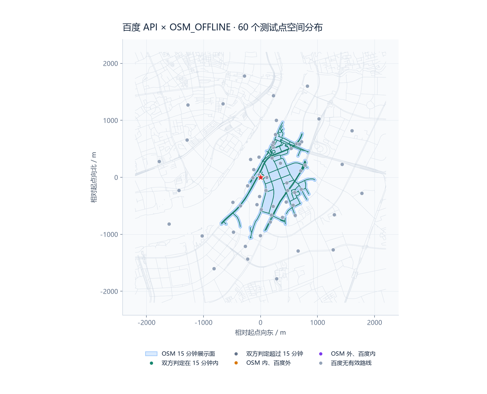
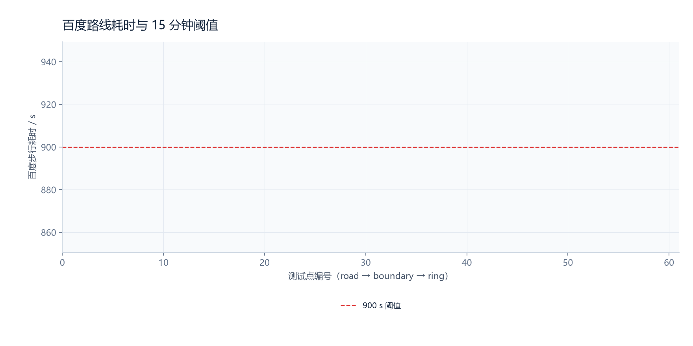
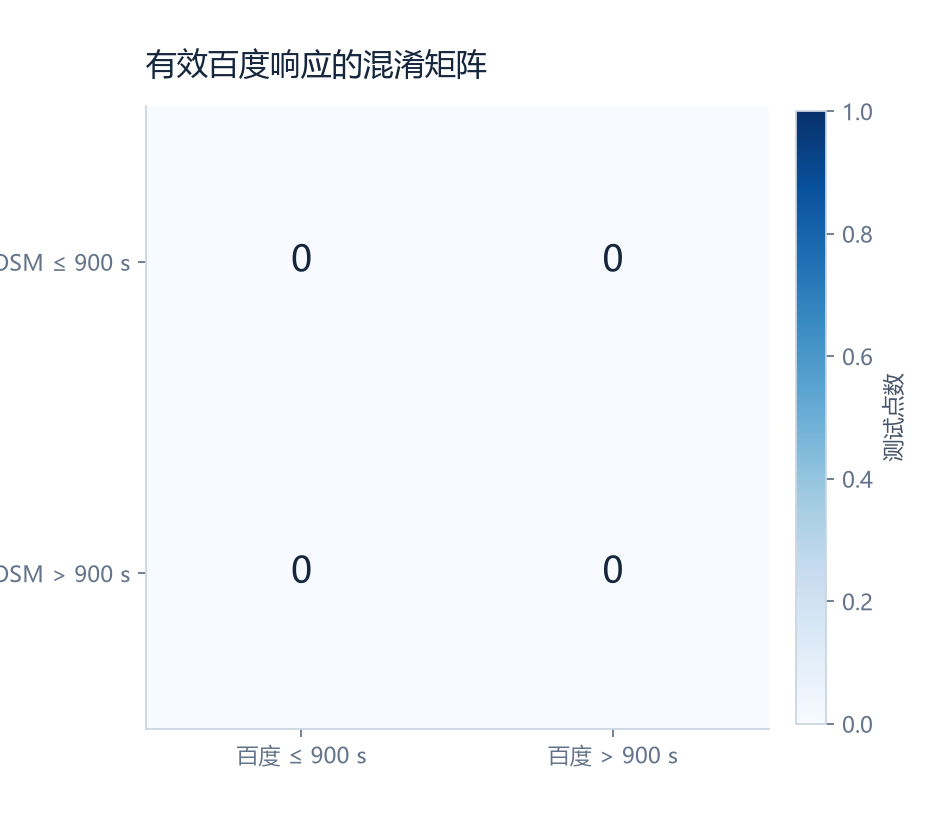

# 百度 API × OSM_OFFLINE 15 分钟验证报告

- 起点：BD09LL `121.511080, 31.204150`（上海样例 A）
- 测试点：`60` 个（road / boundary / ring 各 `20`、`20`、`20`）
- 阈值：`900 s`；每点一次请求、无重试；百度 QPS：`2`
- 生成时间：`2026-09-14T01:46:52.579163+00:00`；Git：`fbb00bad2363401cf914b4c1712ab83616419dad`

## 结果

有效百度响应 **0/60**，未知率 **100.0%**。60 次请求均在收到 HTTP 响应前出现 `ConnectError`，因此没有可用于计算一致率的百度路线耗时。

| TP | TN | FP | FN | 精确率 | 召回率 | 特异度 | 平衡准确率 |
|---:|---:|---:|---:|---:|---:|---:|---:|
| 0 | 0 | 0 | 0 | — | — | — | — |

比较定义：OSM 为离线多边形覆盖判定，百度为路线耗时 ≤ 900 秒。百度 API 作为外部比较参考，不能单独证明任何一方是真实步行时间的绝对真值。

## 可视化

## 分层结果

| 分组 | 总数 | 有效 | TP | TN | FP | FN | 准确率 | F1 |
|---|---:|---:|---:|---:|---:|---:|---:|---:|
| road | 20 | 0 | 0 | 0 | 0 | 0 | — | — |
| boundary | 20 | 0 | 0 | 0 | 0 | 0 | — | — |
| ring | 20 | 0 | 0 | 0 | 0 | 0 | — | — |

## 响应摘要

- 原因计数：`{"temporary": 60}`
- HTTP 状态：`{"none": 60}`
- 百度状态：`{"none": 60}`
- 传输错误：`{"ConnectError": 60}`（运行环境拒绝出站套接字）
- 端点校验通过：`0/60`（无有效百度路线）
- 有效百度耗时范围：`—`–`—` s，中位数 `—` s

完整逐点记录（已去除 API 密钥和原始响应）见 [evidence.json](evidence.json)，浏览器版见 [report.html](report.html)。
