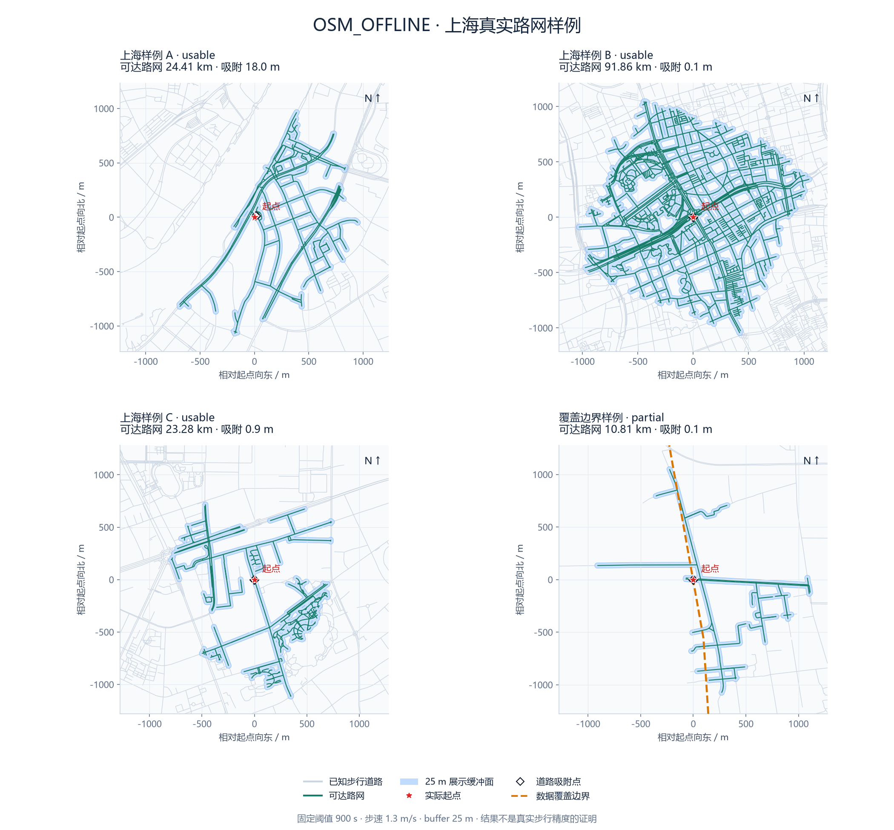
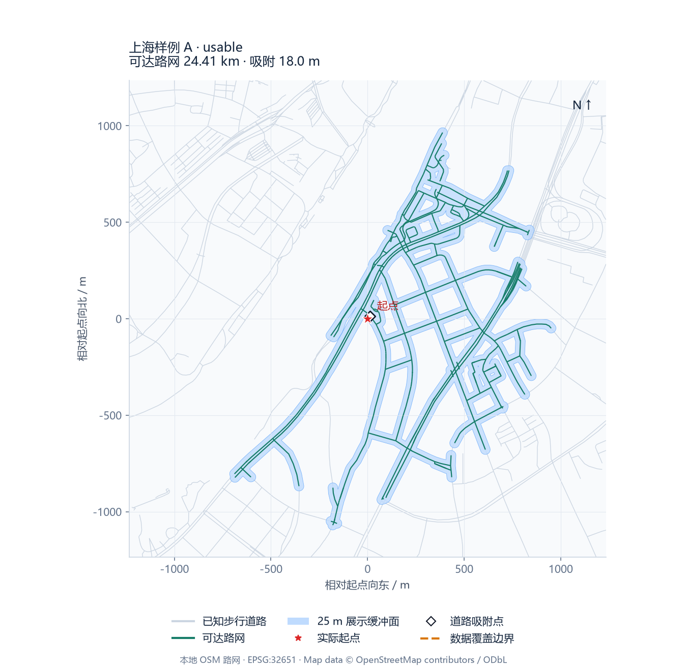
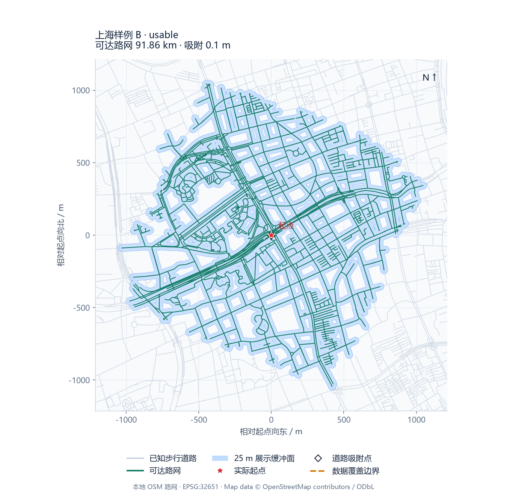
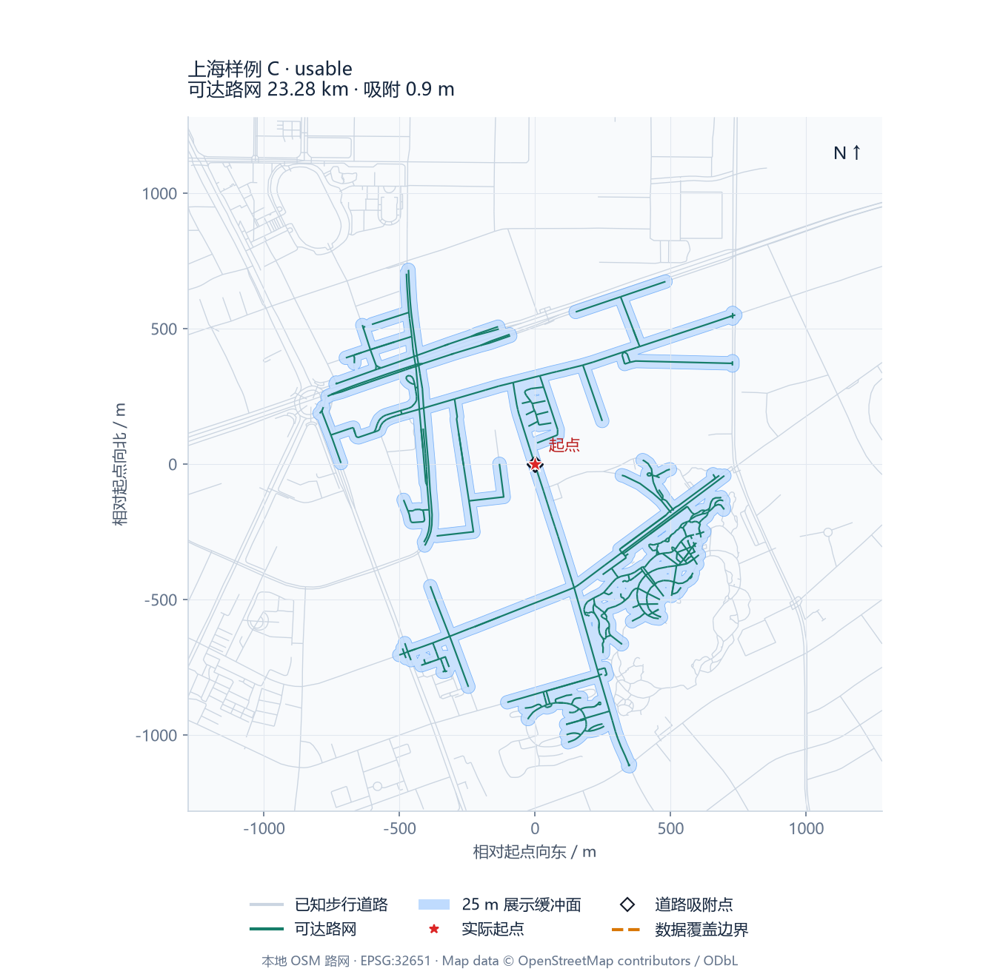
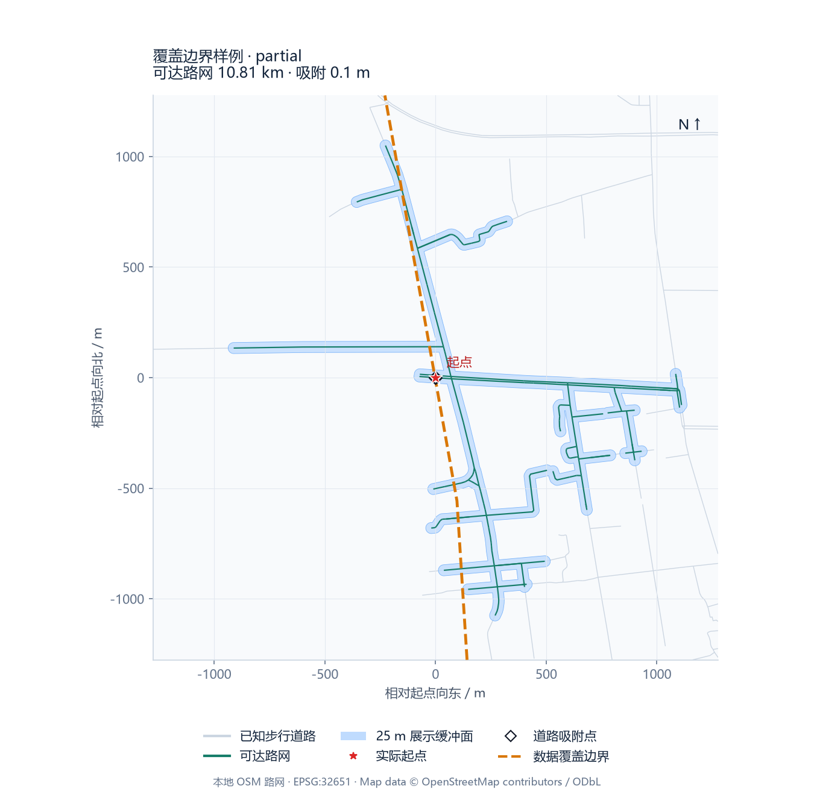
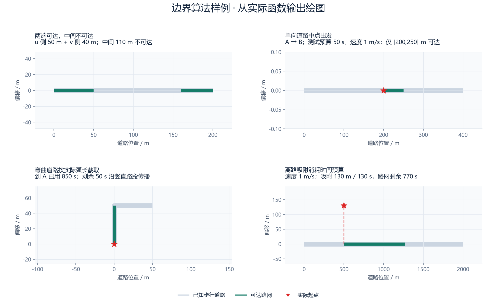
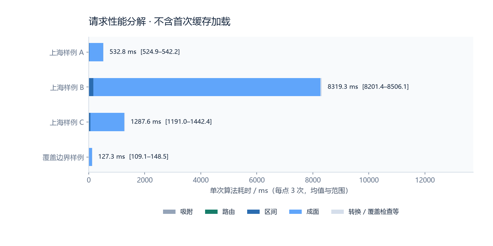

# OSM_OFFLINE 测试报告 · 含真实路网可视化

本轮时间（UTC）：2026-09-14T01:17:24.137802+00:00；被测提交：fbb00bad2363401cf914b4c1712ab83616419dad；Python 3.12.14。本报告依据本轮执行证据生成，没有沿用上一轮的测试计数或耗时。

## 1. 测试结论

本轮覆盖的用例全部通过。OSM 离线计算、方向及区间边界、现有 API 契约、重复输出和共享图不变性均得到验证。这里的通过表示程序符合这些测试断言，不等于真实社区 15 分钟步行边界的精度已被验证。

主要发现：上海样例 B单次耗时 8.20–8.51 秒，缓冲成面平均占总耗时 97.5%。路网密集区域存在明显性能风险，不能把此前单点约半秒的结果推广到全上海。本轮记录该瓶颈，未调整 buffer 或修改算法来改善测试结果。

| 验证内容 | 本轮结果 |
| --- | --- |
| 完整后端回归 | 344 通过 / 1 跳过 / 0 失败；24.58 s |
| 其中 OSM 专项 | 52 通过 / 1 跳过 |
| 真实路网正向样例 | 4 个点 × 3 次引擎计算 + 每点 1 次 HTTP 接口验证 |
| 真实场景负向检查 | 超出 coverage → insufficient；901 秒请求 → HTTP 422 |
| 可视化算法断言 | 4 / 4：双侧间隙、单向中点、弯曲截取、吸附成本 |
| 离线约束 | 实际 socket / DNS 连接尝试：0 |
| 重复性 | 4 个点均在 3 次计算间输出完全相同的几何；HTTP 几何与引擎一致 |
| 共享图完整性 | 前后全图节点属性、边属性及 WKB 几何 SHA256 一致 |

本轮未重新执行大型 PBF 构图，因此默认跳过的 test_real_shanghai_pbf_smoke 不计入本轮通过项。真实缓存加载会验证版本、属性、几何与长度；PBF 和 coverage 文件另做 SHA256 核对。此前构图验收结果可参阅 backend/docs/OSM_OFFLINE.md，不能与本轮测试混算。

## 2. 数据与固定参数

| 项目 | 值 |
| --- | --- |
| 快照 | geofabrik-shanghai-20260912 |
| 图规模 | 274,098 节点 / 721,276 有向边 |
| 输入 / 输出坐标 | BD09LL，[longitude, latitude] |
| 图与绘图投影 | EPSG:32651；各图坐标为相对起点的米制偏移 |
| 时间与速度 | 900 s（含边界）；1.3 m/s |
| 最大吸附 / buffer / coverage margin | 200 m / 25 m / 100 m |
| 本轮首次加载 | 66.36 s，包括校验和空间索引 |

三组普通样例是固定上海坐标，用于程序冒烟，不是经过独立地图核验的地标名称；覆盖边界样例由本地 STRtree 从边界附近道路中确定性选取，专门验证 partial 语义。它们不是随机抽样，不能推断全上海的错误率。

## 3. 上海真实路网可视化

灰线为本地缓存中的已知步行道路，绿线为本次计算得到的可达路网，淡蓝色为固定 25 m buffer 面。红星是实际起点，空心菱形是吸附点；橙色虚线是 extract 覆盖边界。图中未加载在线地图、百度底图或瓦片。各图等比例绘制，但视野独立缩放。



四组真实路网结果。Map data © OpenStreetMap contributors，ODbL。蓝色面是展示表达，不能解释为所有面内位置都具有可行步行路径。

| 样例 | BD09LL 经度, 纬度 | quality | 吸附 m | 路网预算 s | 路网总长 km |
| --- | --- | --- | --- | --- | --- |
| 上海样例 A | 121.511080, 31.204150 | usable | 18.0 | 886.1 | 24.41 |
| 上海样例 B | 121.484781, 31.234311 | usable | 0.1 | 900.0 | 91.86 |
| 上海样例 C | 121.530875, 31.303841 | usable | 0.9 | 899.3 | 23.28 |
| 覆盖边界样例 | 121.075461, 31.182791 | partial | 0.1 | 899.9 | 10.81 |

可达路网总长是分支路段去重后的总长度，并不是单个人在 15 分钟内走过的距离。所有成功样例外层业务 status 均为 partial，因为设施模块未运行；这与 algorithm.quality 是两个不同维度。

## 上海样例 A · 放大样例



上海样例 A：quality=usable；coverage_boundary_hit=False。

## 上海样例 B · 放大样例



上海样例 B：quality=usable；coverage_boundary_hit=False。

## 上海样例 C · 放大样例



上海样例 C：quality=usable；coverage_boundary_hit=False。

## 覆盖边界样例 · 放大样例



覆盖边界样例：quality=partial；coverage_boundary_hit=True。

该样例的可达路网接近数据覆盖边界，算法返回 partial 和 graph_coverage_boundary。它表示结果可能因数据截断而不完整，不能把未覆盖区域认定为不可达。

图中边界外的少量道路仍来自真实缓存。当前 coverage 用于识别可能的数据截断，并不作为删除已知道路的裁剪掩膜。

## 4. 算法边界样例

以下四幅图直接绘制核心函数返回的几何，并在绘图前执行断言。为使数值可手算，合成图使用 1 m/s；单向中点单元场景使用 50 秒预算。它们是算法单元测试条件，不会改变生产接口固定 900 秒的限制。



深绿色为实际返回的可达区间，灰色为完整道路，红星为测试起点。所有几何均来自本轮函数计算。

| 场景 | 预期与本轮断言 |
| --- | --- |
| 双侧 partial | 200 m 道路两端到达时间 850/860 s；可达总长 50+40=90 m，中间 110 m 留空 |
| 单向中点 | P 在 200 m；预算 50 s，只返回 [200,250] m，不创建 P→A 逆向权限 |
| 弯曲道路 | 到起点已用 850 s；只取真实 LineString 前 50 m，不走端点间直线 |
| 吸附成本 | 起点距路 130 m；扣除 130 s，路网剩余 770 s，对应 770 m 片段 |
| 900 秒闭边界（自动测试） | 899.999、900 可达；900.001 不可达 |

## 5. 性能与重复性



每个真实点连续 3 次引擎计算的均值及最小–最大范围；不含初次缓存加载、全图指纹扫描、绘图或 HTTP 序列化。

| 样例 | 平均 ms | 范围 ms | 可达节点 | 有向片段 |
| --- | --- | --- | --- | --- |
| 上海样例 A | 532.8 | 524.9–542.2 | 149 | 435 |
| 上海样例 B | 8319.3 | 8201.4–8506.1 | 1181 | 3400 |
| 上海样例 C | 1287.6 | 1191.0–1442.4 | 224 | 639 |
| 覆盖边界样例 | 127.3 | 109.1–148.5 | 56 | 141 |

这些是单进程、每点 3 次的小样本结果，不提供吞吐量、P95/P99 或并发性能保证。段数按有向边贡献统计，路网总长则为几何 union 后长度。图规模较大，启动校验成本明显高于单次请求。

## 6. 风险、限制与后续验证

OSM 不是 ground truth。当前测试没有独立百度步行验证点、人工路线核验或现场门禁证据，因此不能报告 Accuracy、Recall、IoU 精度或真实出行可用性。灰色道路未显示为可达可能是方向、连通性、预算或 OSM 缺失连接导致，不能仅凭图像断定现实不可达。

起点到道路的直线 snap 仍可能穿过墙、河流或门禁；buffer 可能覆盖不可步行的面积或填平小间隙。中国坐标转换存在近似误差。覆盖边界检查只识别 extract 截断，不识别边界内部漏路。下一步应冻结 buffer，并用 held-out 步行验证点同时评价 OSM 与插值算法。

本轮发现的测试失败为 0。存在两个既有 Starlette / AnyIO 弃用提示，不影响断言。只新增测试与报告工具、证据和图像，未修改生产算法。

## 7. 复现与证据

```text
# 从 backend 目录执行，使用已有本地上海 cache 和 coverage
.venv/Scripts/python.exe -m pip install matplotlib==3.11.2
.venv/Scripts/python.exe -m pytest -q --junitxml=../.tmp/osm-visual-tests/backend.xml
.venv/Scripts/python.exe scripts/test_osm_visual_report.py --output docs/reviews/2026-09-14/osm-offline
.venv/Scripts/python.exe scripts/render_osm_test_report.py --directory docs/reviews/2026-09-14/osm-offline
```

report.html 是可离线打开的自包含版本，图像已嵌入；Markdown、PNG、evidence.json、test-summary.json、backend-junit.xml，以及每点 BD09LL 几何和 metric debug 均在同一目录。GeoJSON 的 coordinateSystem 为 bd09ll，不能直接当作 WGS84 放到底图上。

| 指纹 | SHA256 |
| --- | --- |
| pbf_sha256 | 0490e886ef41881928c1b10500ee280ef009a892ac43d8a476fc082894064b82 |
| cache_sha256 | 43e2ec797447cad45ed962a2dffe3030e188a5618f90e0dfb9d82e8d472994e1 |
| coverage_sha256 | c34d551f02a2d42f327e2f123fd2f28399fd914b36ab46f0c099e15b68ae0f59 |
| graph_fingerprint | 0c39d4115942ad949935c8554eeed009dc88bb1fda200632a611562bfd8e04f2 |

Map data © OpenStreetMap contributors。数据许可：Open Database License (ODbL)。
