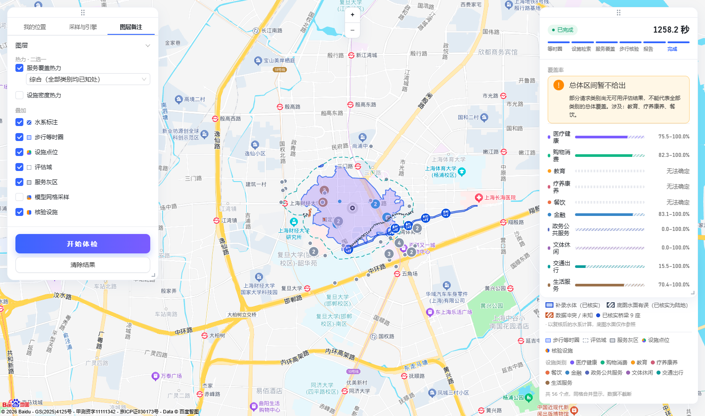
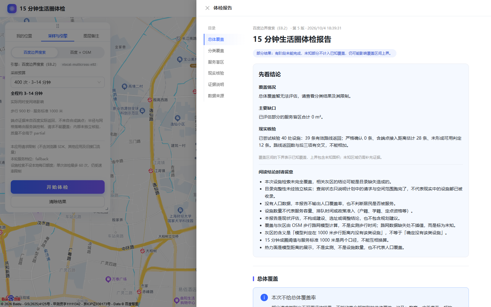
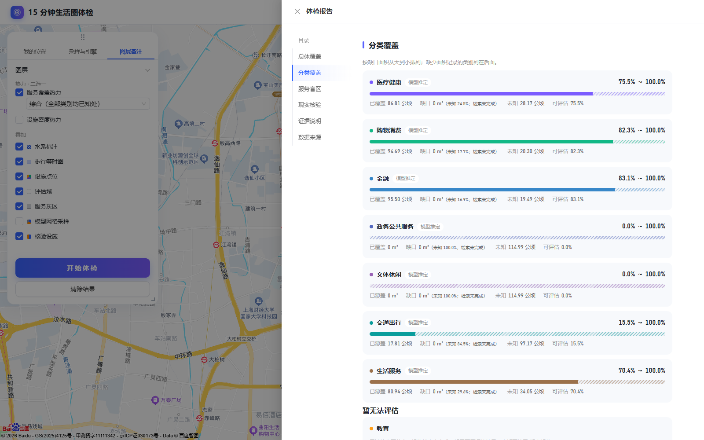
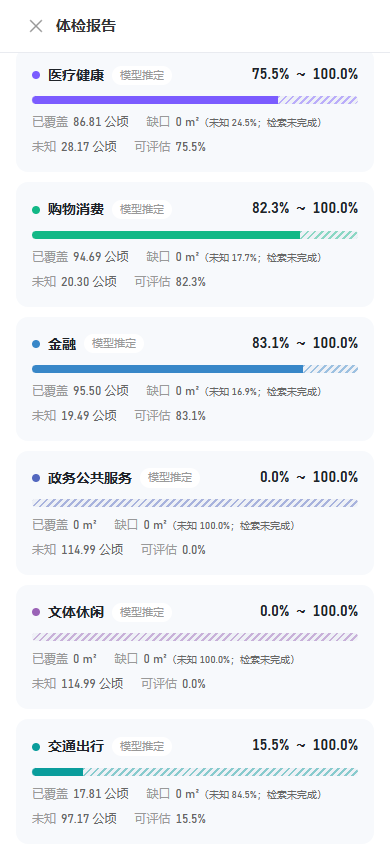
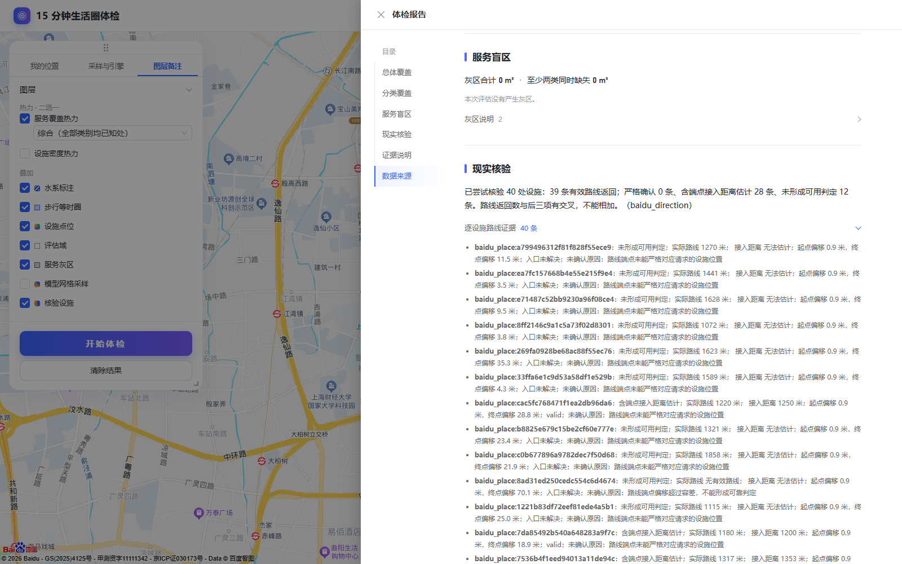

# 取消本地日额度后设施报告复验（2026-10-04）

## 结论

按用户要求，移除设施检索的默认本地日额度后，以国定一社区执行**一次**真实百度体检。任务 `146d2476-6419-4e76-b9a6-2f408338c99a`（请求号 `dc23ce52-7826-4036-a87c-7b2c70a34deb`）已完成，第 5 版报告和图层同源冻结。真实底图和端到端 Playwright 验收 **2 项通过**。后端运行时能力接口显示本地设施日额度为 `null`、设施速率上限 2 QPS、单任务设施预算 60 次。

本轮网络调用严格为 **400 次成圈＋60 次设施检索＋120 次路线核验＝580 次**；任务计数同为 580。设施停止原因是 `budget_exhausted`（单任务 60 次用尽），没有再次遇到本地 `daily_budget_exhausted`，也没有记录百度返回的配额拒绝。10 类各得到 6 次设施检索机会，全部仍有未完成关键词或空间范围，因此检索状态为 `partial`。

报告是**可阅读、可追溯的部分设施报告**，并非完整的十类总体覆盖率。它列出全部 10 类：7 类有覆盖区间，其中政务公共服务和文体休闲是 `0%～100%`、未知面积 100%，几乎没有覆盖判定信息；教育、疗养康养、餐饮因检索未完成且无可用覆盖证据而列为“暂无法评估”。总体覆盖率保持不可用，没有用其余类别冒充全部十类。

| 类别 | 报告覆盖区间 | 未知比例 | 说明 |
| --- | ---: | ---: | --- |
| 医疗健康 | 75.5%～100% | 24.5% | 检索未完成 |
| 购物消费 | 82.3%～100% | 17.7% | 检索未完成 |
| 金融 | 83.1%～100% | 16.9% | 检索未完成 |
| 政务公共服务 | 0%～100% | 100% | 全部未知 |
| 文体休闲 | 0%～100% | 100% | 全部未知 |
| 交通出行 | 15.5%～100% | 84.5% | 检索未完成 |
| 生活服务 | 70.4%～100% | 29.6% | 检索未完成 |
| 教育、疗养康养、餐饮 | 暂无法评估 | — | 检索未完成，不能解释为零设施或零覆盖 |

本轮检索形成 16 条设施记录：医疗 3、购物 3、金融 8、生活服务 2；其余类别当前记录为 0，但目录检索未完成。已评估类别显示的“缺口 0”须与未知比例一起读，不能推出实际无缺口。

路线核验尝试 40 处设施，统计为 **39 条有效路线返回、0 条严格确认、28 条含端点接入距离的容差估计、12 条未形成可用判定**。路线返回与后三项有交叉，不能相加。逐设施证据保留实际路线距离、两端偏移、入口状态和未确认原因，严格确认阈值未变。

## 与前一轮对照

| 项目 | 本地日额度仍生效的前一轮 | 本轮默认无本地日额度 |
| --- | ---: | ---: |
| 设施网络调用 | 20/60，受本地日额度拦截 | 60/60，单任务预算用尽 |
| 各类机会 | 9 类各 2 次，医疗第 3 次被本地额度拦截 | 10 类各 6 次 |
| 有覆盖区间／暂无法评估 | 6／4 类 | 7／3 类 |
| 有效路线返回 | 35 | 39 |
| 严格确认／容差估计／未形成判定 | 0／28／7 | 0／28／12 |
| 十类总体覆盖率 | 不可用 | 不可用 |

增加设施调用改善了各类的检索机会，并让交通出行产生可展示的区间；在 60 次预算内仍无法完成十类目录与空间范围。若目标是**有数值的十类总体覆盖率**，本轮真实结果尚未满足该条件，不能通过补零或只对已有类别重新加权来制造数值。

## 冻结材料与截图

- [任务元数据](assets/checkup-facility-acceptance-uncapped-20261004/task.json)、[冻结报告](assets/checkup-facility-acceptance-uncapped-20261004/report.json)、[类别调用分布和未完成项](assets/checkup-facility-acceptance-uncapped-20261004/category-call-distribution.json)、[核验审计](assets/checkup-facility-acceptance-uncapped-20261004/verification-audit.json)。完整快照及六个图层另保存在本地 `life-circle-demo/output/checkup-acceptance-uncapped-20261004/baidu_e82/`。
- 截图均来自**同一任务**；任务完成后的补拍脚本阻止新的体检 POST 请求。

