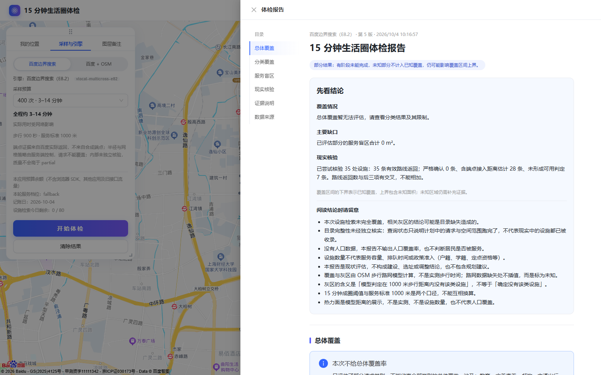
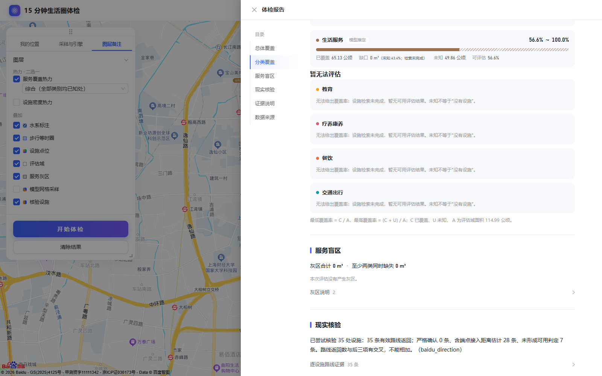
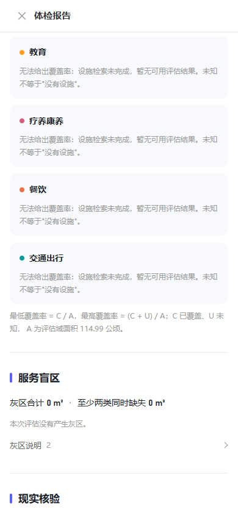
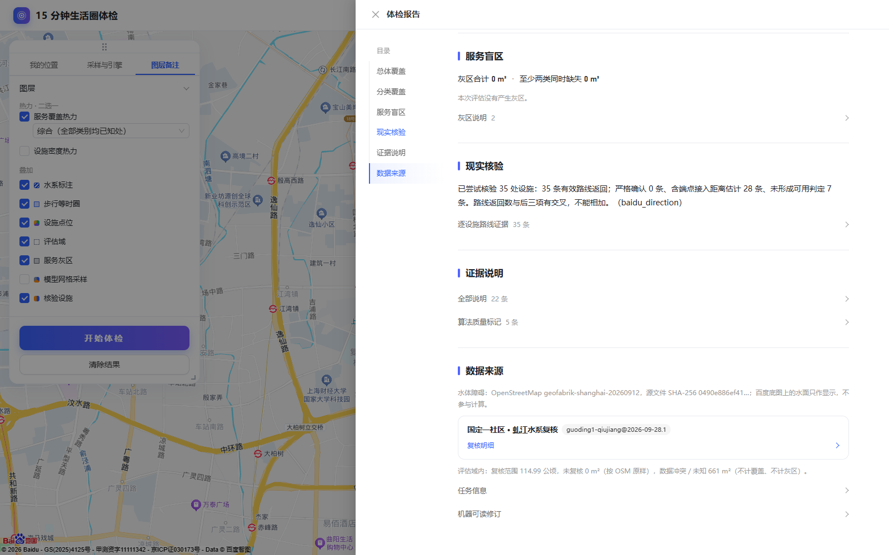
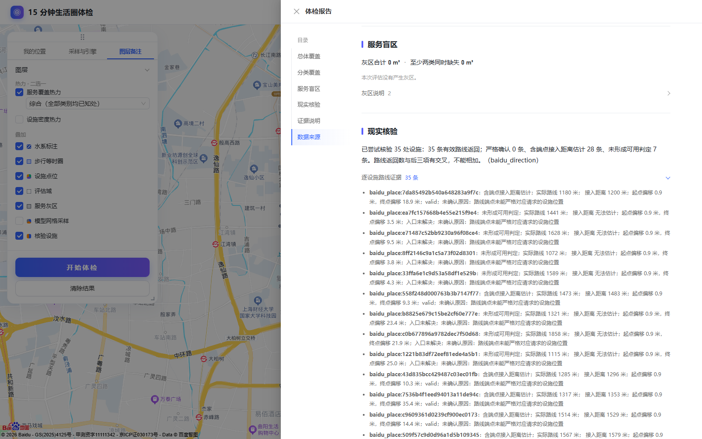

# 设施检索与十类报告验收（2026-10-04）

## 范围与结果

本轮保留设施检索任务上限 60 次、原有限流与严格端点确认阈值，未修改成圈算法、日额度或路网冷启动。代码只保留在本地。离线调度、报告、核验及前端检查通过后，对国定一社区执行了**一次**真实任务；其任务号为 `1370e522-90a2-449e-916c-6ae7545e6835`，`clientRequestId` 为 `b65ba854-d1db-4e67-84df-617dcc59e06f`。补拍界面截图只读取同一已完成任务，并在脚本中阻止新任务提交。

真实任务完成，业务状态为 `partial`。成圈网络调用为 **400/400**，设施网络调用为 **20/60**，核验网络调用为 **115/120**；合计网络调用 **535**。任务计数为 **536**，多出的一次是设施日额度拒绝的计划尝试，没有发生网络调用。设施接口当日剩余 20 次额度，停止原因 `daily_budget_exhausted`。因此本轮验证了任务预算守恒与类别机会轮换，**没有**声称 60 次设施检索已执行，也没有把未完成检索当成零设施。

## 检索分配与报告

服务端目录版本冻结为 `poi-categories-v2.0`，顺序为医疗健康、购物消费、教育、疗养康养、餐饮、金融、政务公共服务、文体休闲、交通出行、生活服务。调度按大类轮换，在首轮依空间块中心距离和块标识依次处理各类首个小类的主关键词，之后处理其他主关键词、补充关键词、分页、细分块及重试。所有请求仍通过既有预算与限流器。

真实任务中，10 类各触及前两个空间块；9 类各发生 2 次设施请求，医疗健康记录 3 次计划尝试，其中第 3 次被日额度拦截。每类都有未完成检索项，`queryCompleteByMajor` 均为 `false`，总体检索状态为 `partial`。冻结的[类别调用分布](assets/checkup-facility-acceptance-20261004/category-call-distribution.json)保存了每类次数、触及块、未完成项与停止原因。

冻结报告列出全部 10 类。6 类有可展示的覆盖区间；教育、疗养康养、餐饮、交通出行进入“暂无法评估”，原因是设施检索未完成。总体覆盖标为不可用，明确列出这 4 类，不把其余 6 类重新加权为全部类别的总分。有可展示区间的类别即使缺口为 0，也同时展示未知比例与检索未完成。目录、侧栏、图例、筛选项、设施列表使用同一服务端类别目录及中文名称。旧报告优先读取冻结目录；没有冻结目录的历史版本只展示其已有类别，并说明无法确认当时请求范围。

## 核验证据与存档对照

新增的四项统计分开表示“有效路线返回”和“严格确认／端点容差估计／未形成可用判定”。前者可能与后三者交叉，**不能相加**。严格确认阈值及 `poiStatus` 语义未放宽。设施详情与报告共用原因翻译，显示证据层级、实际路线距离、起终点偏移、接入距离、入口状态与未确认原因；容差估计写明含端点接入距离，不标成严格确认。

| 来源 | 有效路线返回 | 严格确认 | 端点容差估计 | 未形成可用判定 |
| --- | ---: | ---: | ---: | ---: |
| 既有 40 条设施存档，离线复核 | 38 | 0 | 33 | 7 |
| 本轮国定一社区真实任务 | 35 | 0 | 28 | 7 |

真实任务核验尝试 35 处设施，路线调用 115/120；其[核验审计](assets/checkup-facility-acceptance-20261004/verification-audit.json)与[冻结报告](assets/checkup-facility-acceptance-20261004/report.json)统计一致。既有存档中的 `pending` 不再被直接解释为“路线无效”；按冻结设施证据归纳得到上表第一行。旧报告缺少新增统计字段时也只归纳同份冻结证据，不发起接口调用。

## 验证记录

- 后端调度、目录、核验统计与评分测试：**35 通过**；核验与在线路线测试：**18 通过**。
- 完整报告流水线集成用例：**1 通过**。该用例在 10 类与冷图环境下耗时约 236 秒，因此超时设置为 300 秒；未调整路网算法。
- 前端单测：**165 通过**；TypeScript 构建检查通过。
- 模拟界面验收覆盖桌面 1280 像素和窄屏 390 像素的十类报告、图例与缺失类别；新增的两个界面用例通过。原有两处三类文案断言已更新并通过。截图另见本地 `life-circle-demo/output/checkup-ui/`。
- 真实界面截图检查了地图、报告顶部、缺失类别、窄屏与展开的逐设施证据；目录跳转停留在同一路由。真实任务的[地图](assets/checkup-facility-acceptance-20261004/map.png)与[任务元数据](assets/checkup-facility-acceptance-20261004/task.json)一并保存。

此次真实验收的限制来自当天设施接口剩余额度。十类均获得检索机会，但没有一类可宣称检索完整；四类缺少可用覆盖结论，报告已如实保留未知。严格确认数为零符合现有阈值，本轮没有以提高确认数作为通过条件。

## 后续额度设置（2026-10-04）

复核确认，验收时触发的 80 次设施日额度是本项目的本地保护值，来自保守档配置及 SQLite 日账本，并非百度接口返回的额度拒绝。按用户后续要求，现已将本地设施日额度改为**默认不设上限**；部署方仍可显式配置日额度。单任务 60 次设施预算、速率限制和百度接口自身返回的配额错误处理继续生效。以上历史验收数据和截图保持原样，不代表修改后重新执行过计费任务。
